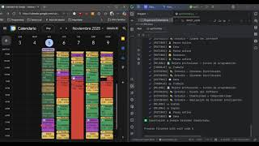

# 📅 Planner — IA + Google Calendar

## 🎥 Demo rápida

<p align="center">
  <a href="https://youtu.be/6F2f68ywMzI">
    
  </a>
</p>


**CalendarIA** es una herramienta que combina inteligencia artificial (IA Gemini) y automatización para generar planes de estudio y trabajo, exportables como .ics y sincronizables con Google Calendar.
## 📖 Índice

1. [✨ Funcionalidades principales](#-funcionalidades-principales)  
2. [🧰 Requisitos previos](#-requisitos-previos)  
3. [⚙️ Instalación](#️-instalación)  
   - [Clonar el repositorio](#1️⃣-clonar-el-repositorio)  
   - [Crear entorno virtual](#2️⃣-crear-entorno-virtual)  
   - [Instalar dependencias](#3️⃣-instalar-dependencias)  
   - [Copiar variables de entorno](#4️⃣-copiar-variables-de-entorno)  
4. [🔑 Configuración de Google Calendar API](#-configuración-de-google-calendar-api)  
   - [A) Crear el proyecto](#a-crear-el-proyecto)  
   - [B) Habilitar la API](#b-habilitar-la-api)  
   - [C) Pantalla de consentimiento OAuth](#c-pantalla-de-consentimiento-oauth)  
   - [D) Crear credenciales OAuth](#d-crear-credenciales-oauth-después-de-crear-te-aparecería-esta-pantalla)  
   - [🪙 Generación automática del token.pickle](#-generación-automática-del-tokenpickle)  
5. [🤖 Obtener el token de la API de Gemini](#-obtener-el-token-de-la-api-de-gemini)  
6. [🧭 Configuración de ejemplo](#-configuración-de-ejemplo)  
   - [🗓️ Horario semanal y trabajo](#️-horario-de-semanal-y-trabajo)  
   - [🔃 Subcalendarios (calendarsyaml)](#-definición-de-el-id-de-los-subcalendarios-google-por-defecto-el-calendario-principal-es-primary)  
   - [⚙️ Configuración general (settingstoml)](#configuración-de-hora-y-modelo-de-gemini)  
7. [▶️ Uso](#️-uso)  
8. [🧹 Comando auxiliar: Purga de eventos](#-comando-auxiliar-purga-de-eventos)  
9. [⚠️ Problemas comunes](#️-problemas-comunes)  
10. [📜 Licencia](#-licencia-)  
11. [💬 Créditos](#-créditos)


---

## ✨ Funcionalidades principales

- 🎯 Generación automática de horarios mediante IA (Gemini).
- 🧩 Configuración modular: se puede editar el **prompt**, **horario laboral** y **asignaturas**.
- 📆 Conversión directa a formato `.ics` y sincronización con **Google Calendar**.
- 🔁 Mapeo inteligente de eventos por categoría (Estudios, Rutinas, Trabajo...).
- 🧹 Comando auxiliar para **borrar eventos antiguos** con modo simulación (`dry-run`).

---

---

## 🧰 Requisitos previos

- **Python 3.11+**
- Clave de **Gemini API** → [https://ai.google.dev/](https://ai.google.dev/)
- Proyecto en **Google Cloud** con **Google Calendar API** habilitada.
- Credenciales **OAuth 2.0 (Aplicación de escritorio)**.

---

## ⚙️ Instalación

### 1️⃣ Clonar el repositorio

```bash
git clone https://github.com/DevOkana/CalendarIA.git
cd CalendarIA
```

### 2️⃣ Crear entorno virtual
```bash
python -m venv .venv
# Windows
.\.venv\Scripts\Activate.ps1
# Linux/Mac
source .venv/bin/activate
````
### 3️⃣ Instalar dependencias
```bash
pip install -r requirements.txt
```

### 4️⃣ Copiar variables de entorno
```bash
cp .env.example .env
```
Edita .env con tus valores:
```ini
    GOOGLE_API_KEY=TU_API_KEY_DE_GEMINI
    GOOGLE_CLIENT_SECRETS_FILE=secrets/calendar.json
    TIMEZONE=Europe/Madrid
    LANG=es
```

---

## 🔑 Configuración de Google Calendar API

### A) Crear el proyecto

1. Accede a [Google Cloud Console](https://console.cloud.google.com/).
2. Crea un nuevo **proyecto** llamado `CalendarIA`.
3. Crear y entrar en el proyecto.

### B) Habilitar la API
* Menú lateral: **APIs y servicios → Biblioteca**.
* Busca “Google Calendar API”.
* Pulsa **Habilitar**.

### C) Pantalla de consentimiento OAuth

* Menú: **APIs y servicios → Pantalla de consentimiento OAuth** -> **Comenzar**.
* Configurar el nombre de la aplicación que se conectara(puede ponerle el mismo nombre).
* Contacto de asistancia: rellena tu correo.
* Tipo de usuario: **Usuarios Externos**.
* Rellena correo de contacto.
* Acepta los términos y guarda los cambios.

### D) Crear credenciales OAuth (Después de crear te aparecería esta pantalla)

1. Menú → **Clientes**.  
2. **Crear cliente → ID de cliente de OAuth**.  
3. Tipo: **Aplicación de escritorio**, Nombre: el que prefieras.  
4. Descarga el archivo JSON y colócalo en la ruta **secrets/calendar.json** con el nombre:

   ```
   calendar.json
   ```
5. Finalmente, en el apartado **“Publicar”**, haz público el proyecto, o el acceso podría estar bloqueado al iniciar sesión.
6. Al ejecutarse localmente, es normal que el navegador advierta sobre el certificado. Acepta continuar.
### 🪙 Generación automática del `token.pickle`

El archivo `token.pickle` **no se descarga ni se crea manualmente**.  
Se genera automáticamente la **primera vez que ejecutas el script** (por ejemplo, `python src/CalendarIA/cli.py plan`) con tus credenciales OAuth correctas (`secrets/calendar.json`).

Durante la primera ejecución:
1. Se abrirá una ventana del navegador.
2. Inicia sesión con tu cuenta de Google y acepta los permisos.
3. Tras autorizar, se crea el archivo:
 ```bash
  ecrets/token.pickle
```
Ese archivo almacena el **token de autenticación** para que no tengas que volver a iniciar sesión.  
Si lo eliminas, el programa volverá a pedir autorización en el siguiente uso.

👉 En el primer uso se abrirá una ventana del navegador para autorizar tu cuenta.
Después se generará automáticamente `secrets/token.pickle`.
---
## 🤖 Obtener el token de la API de Gemini
1. Entra en [https://aistudio.google.com/app/apikey](https://aistudio.google.com/app/apikey).  
2. Inicia sesión con tu cuenta de Google.  
3. Pulsa **“Create API key”** → selecciona *“Personal project”*.  
4. Copia la clave generada y añádela en tu archivo `.env`:

```
  GOOGLE_API_KEY = TU_API_KEY_DE_GEMINI
```
---

---

## 🧭 Configuración de ejemplo
Recuerda renombrar y editar los archivos en `config/` según tus necesidades.
Hay dos archivos que incluyo el ejemplo mínimo para que funcione. Pero antes hay que renombrar
quitandole el `.example` al final.
## 🧠 Prompt de IA (editable)

El plan lo genera un **prompt** que puedes modificar libremente.  
- Archivo por defecto: [`prompts/prompt_es.txt`](prompts/prompt_es.txt)  
- Idioma: libre (el ejemplo está en español).  
- **Nota:** el prompt incluido es **solo un ejemplo**; adáptalo a tu estilo y reglas.

## 🗓️ Horario de Semanal y Trabajo
En este apartado vas a definir el inicio de la semana y el final hasta donde quieres que 
se te cree el calendario luego en trabajo bas a definir el día que trabajas siendo la clave
y el valor sera el horario de trabajo si descansa utiliza la palabra ***Libranza***.
### `config/schedule.yaml`

```yaml
semana_inicio: "2025-11-05"
semana_final:  "2025-11-16"

trabajo:
  "2025-11-05": "Libranza"
  "2025-11-06": "13:00 - 15:30"
  "2025-11-07": "13:30 - 22:00"
  "2025-11-08": "Libranza"
  "2025-11-09": "13:00 - 15:30"
  "2025-11-10": "Libranza"
```
## 🔃 Definición de el id de los subcalendarios. Google por defecto el calendario principal es primary
### `config/calendars.yaml`
Ruta donde se encuentra:  
1. **Configuración --> Configuración de mis calendarios**
2. **"Nombre del calendario" --> Dirección pública en formato iCal**
3. **SI NO CONFIGURA NINGUN CALENDARIO SE USARA EL PRINCIPAL (primary)**

```yaml
ESTUDIOS: "7c79...be7@group.calendar.google.com"
MEJORA:   "0083...d2739@group.calendar.google.com"
RUTINAS:  "3c17...a559c9e@group.calendar.google.com"
TRABAJO:  "89aa...eedeb6@group.calendar.google.com"
DEFAULT:  "primary"
```

Aquí tienes esa información formateada como una sección de un archivo `README.md`, combinando tus descripciones con el bloque de código de ejemplo.

-----

## Configuración de Hora y modelo de Gemini

### `config/settings.toml`

A continuación se describen las opciones disponibles en el archivo de configuración `config/settings.toml`.

#### `[calendar]`

Define las propiedades básicas del calendario que se va a generar.

  * `name`: El nombre que verá tu calendario en tu aplicación (ej. "Plan UNED — Semana").
  * `timezone`: Tu zona horaria local. Es crucial para que los eventos se muestren a la hora correcta (ej. "Europe/Madrid", "America/New\_York").

#### `[model]`

Define el motor de Inteligencia Artificial (IA) que generará el plan de estudios.

  * `name`: Especifica el modelo de Google Gemini a utilizar. La elección influye en la velocidad y el detalle del plan.
      * `gemini-2.5-pro`: Más potente, ideal para planes detallados.
      * `gemini-2.5-flash`: Más rápido y eficiente, para resultados inmediatos.
      * `Más modelos de gemini`: Visitar la web https://ai.google.dev/gemini-api/docs?hl=es-419
#### `[output]`

Define los nombres de los archivos que se crearán.

  * `base_name`: Nombre base que se usará como prefijo para los archivos generados.
  * `json`: El nombre del archivo `.json` que contendrá los datos brutos del plan.
  * `ics`: El nombre del archivo `.ics` (iCalendar) que importarás a tu aplicación de calendario.

-----

**Ejemplo de configuración:**

```toml
[calendar]
name = "Plan UNED — Semana"
timezone = "Europe/Madrid"

[model]
name = "gemini-2.5-pro"

[output]
base_name = "plan_example"  # Base name for output files
json = "plan_example.json" # Output JSON file name
ics = "plan_example.ics"  # Output ICS file name
```
## ▶️ Uso

### Generar plan completo (JSON → ICS → Google Calendar)

```bash
python src/CalendarIA/cli.py plan
```

### Generar solo JSON

```bash
python src/CalendarIA/cli.py generate-json
```

### Convertir JSON → ICS

```bash
python src/CalendarIA/cli.py json-to-ics
```

### Importar ICS → Google Calendar

```bash
python src/CalendarIA/cli.py import-ics
```

---

## 🧹 Comando auxiliar: Purga de eventos

Modo simulación (sin borrar):

```bash
python src/CalendarIA/cli.py purge --since 2025-11-04
```

Borrado real:

```bash
python src/CalendarIA/cli.py purge --since 2025-11-04 --no-dry-run
```

Filtrar por prefijo de título:

```bash
python src/CalendarIA/cli.py purge --since 2025-11-04 \
  --prefix "📚 Estudio —" --prefix "💼 Trabajo" --no-dry-run
```

---

## ⚠️ Problemas comunes

| Error                          | Causa                                     | Solución                            |
| ------------------------------ | ----------------------------------------- | ----------------------------------- |
| `NoneType 'trabajo'`           | YAML vacío o mal indentado                | Verifica `config/schedule.yaml`     |
| `JSONDecodeError`              | Gemini devolvió texto extra o llaves `{{` | Abre el archivo y revisa el formato |
| `429 Quota exceeded`           | Límite de peticiones Gemini gratis        | Espera 60 s o habilita facturación  |
| `TypeError: ensure_api_auth()` | Falta `calendar.json`                     | Genera credenciales en Google Cloud |
| `ModuleNotFoundError`          | Dependencias faltantes                    | `pip install -r requirements.txt`   |

---


## 📜 Licencia [](LICENSE)


**MIT License © 2025**
Puedes modificar, distribuir y usar libremente siempre que mantengas la atribución original.

---

## 💬 Créditos

Desarrollado con 💡 por Okana
Inspirado en los sistemas de planificación de la UNED y en la integración local con Gemini + Google Calendar.
¡Gracias por usar CalendarIA! 🚀

[](LICENSE)


